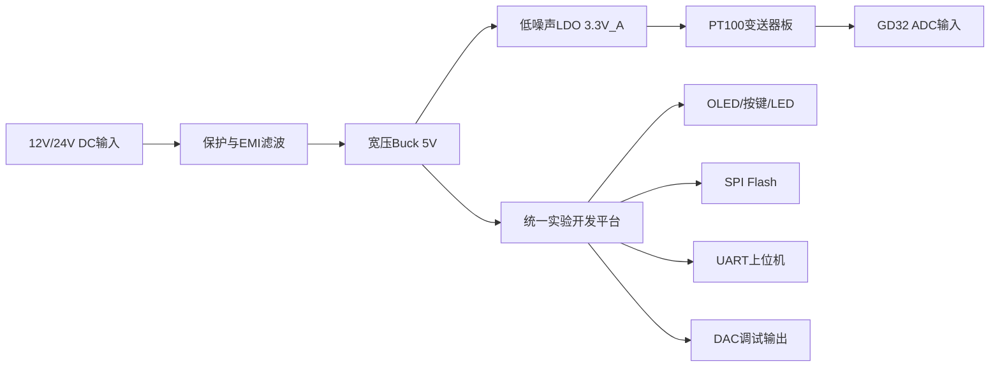
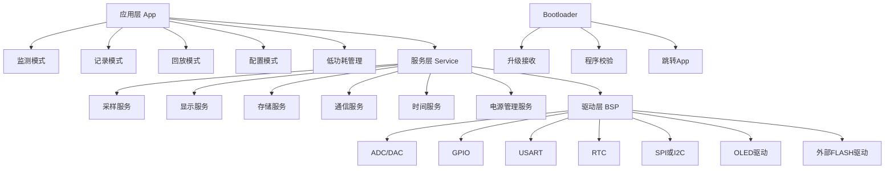
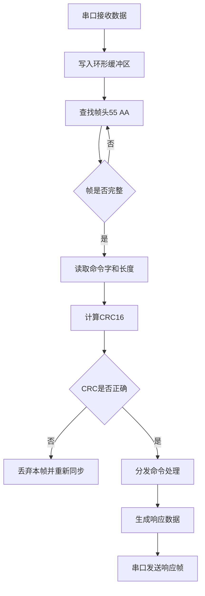
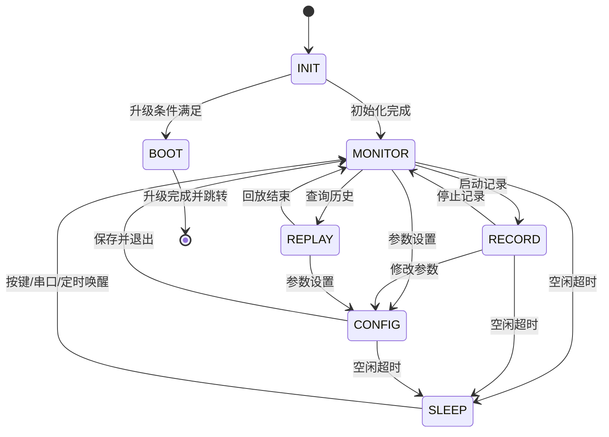
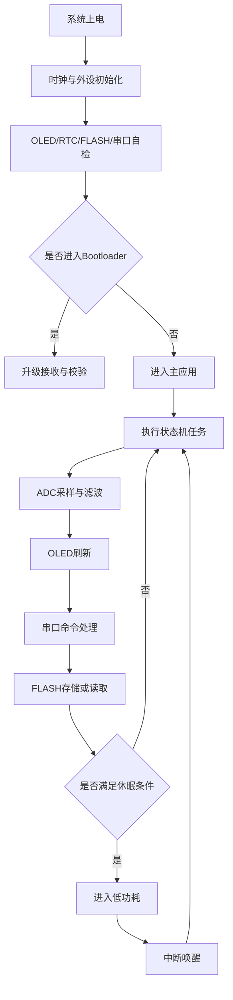

# 系统方案设计书

## 项目名称
基于 `GD32F470VET6` 的工业参数采集与存储系统设计

## 一、项目概述
本系统面向工业现场电压、温度等模拟量采集、显示、存储与通信需求，基于统一实验开发平台，以 `GD32F470VET6` 为主控芯片，完成嵌入式软件系统与配套扩展硬件设计。系统能够实现 `ADC` 数据采集、`DAC` 输出、`OLED` 信息显示、按键输入、`LED` 状态指示、串口通信、`RTC` 实时时钟、外部 `FLASH` 数据存储、低功耗运行及 `Bootloader` 基础升级功能，并完成面向初赛要求的电源板与 `PT100` 变送器方案设计，形成一套可运行、可测试、可扩展的工业参数采集终端。

本方案以“供电-采样-调理-处理-显示-存储-通信”为主线，突出系统完整性、稳定性与工程可扩展性。设计过程中遵循模块化、分层化、低耦合原则，在统一主控平台基础上同步完成电源板和 `PT100` 变送器设计，并为后续决赛阶段外部模拟采样电路及外置 `ADC` 方案预留接口和软件适配能力。

## 二、设计目标
系统需达到以下目标：

- 完成模拟电压采集与数值换算，支持实时显示与周期存储。
- 完成 `DAC` 输出控制，用于调试验证及扩展功能演示。
- 完成配套电源板设计，满足主控平台与模拟前端稳定供电需求。
- 完成 `PT100` 变送器设计，实现温度阻值到标准电压信号的调理转换。
- 实现本地人机交互，包括按键模式切换、参数设置、`OLED` 页面显示与 `LED` 状态指示。
- 实现串口数据收发与报文解析，支持上位机联调和自动测评。
- 实现基于 `RTC` 的时间读取与设定，并为存储记录添加时间戳。
- 实现外部 `FLASH` 的读写操作，支持历史数据保存与回读。
- 实现空闲低功耗运行及中断唤醒机制。
- 实现串口 `Bootloader` 基础功能，为后续程序升级提供支持。

## 三、总体方案设计
系统采用“统一主控平台 + 专用模拟硬件扩展 + 软件分层实现 + 应用状态机调度”的总体设计思路。硬件上由 `GD32F470VET6` 实验开发平台、电源板、`PT100` 变送器板和上位机组成；软件上底层通过外设驱动完成对主控芯片资源的统一访问，中间层通过服务模块实现采样、显示、存储、通信等通用能力，上层以应用状态机统筹系统运行逻辑。

系统上电后，先完成时钟、外设、显示、串口、存储器、实时时钟等初始化，并进行必要的自检；随后根据按键状态或串口命令判断是否进入 `Bootloader` 模式；若不进入升级模式，则启动主应用程序，按照当前工作模式执行采样、显示、存储、响应用户输入及通信交互；在空闲状态下，系统进入低功耗休眠，并通过按键、串口或定时事件唤醒。

系统工作模式建议分为以下几类：

- 实时监测模式：周期采集模拟量，并在 `OLED` 上显示当前数值、时间和工作状态。
- 数据记录模式：按照设定周期将采样值和时间戳写入外部 `FLASH`。
- 数据回放模式：从外部 `FLASH` 中读取历史记录，并通过串口上传至上位机。
- 参数配置模式：通过按键或串口配置采样周期、时间、`DAC` 输出值、记录开关等参数。
- 低功耗待机模式：系统无操作时进入休眠，降低功耗。

## 四、硬件方案设计
系统硬件围绕样题要求拆分为“统一实验开发平台 + 电源板 + `PT100` 变送器板”三部分。统一平台负责运算控制、显示、通信与存储；电源板负责把工业现场输入转换为稳定的系统供电；`PT100` 变送器板负责完成温度信号激励、放大、滤波与标准化输出。三者通过标准电源口、模拟采样口和调试接口连接，既满足初赛硬件开发要求，也便于后续扩展。

### 1. 硬件总体架构


### 2. 电源板设计
电源板定位为主控平台和模拟前端提供独立、稳定、可测的工业供电接口。结合工业现场常见 `12V/24V` 直流电源，输入端按 `9V` 至 `36V` 宽压进行设计，并在接口处加入自恢复保险丝、反接保护、`TVS` 管和 `LC` 滤波网络，用于抑制浪涌、反接和高频干扰。

主功率转换级采用兆易创新通用电源管理系列中的宽压 `Buck` 器件，例如 `GD30DC1502WGTR-I`，先生成 `5V` 主电源；再通过低噪声 `LDO`，例如 `GD30LD3137WETR`，派生 `3.3V_A` 模拟电源。`5V` 主要供给统一平台、`OLED`、外部 `FLASH` 和接口外设，`3.3V_A` 主要供给 `PT100` 变送器及模拟量采样参考链路。通过“开关电源负责效率、线性稳压负责噪声”的组合，可同时兼顾工业输入适应性与模拟采样精度。

为便于调试与评审，电源板预留 `VIN`、`5V`、`3.3V_A`、`GND` 测试点和电源状态指示灯，并在输出端配置足够的电解/陶瓷去耦电容，保证主控突发负载和串口通信时电压稳定。设计目标为：`24V` 输入下 `5V` 输出纹波不大于 `50mVp-p`，模拟 `3.3V_A` 纹波不大于 `20mVp-p`，满足嵌入式主控和模拟前端共板工作的供电要求。

### 3. PT100 变送器设计
`PT100` 变送器用于将温度阻值信号调理为主控 `ADC` 可直接采集的标准电压。考虑工业现场抗干扰和导线补偿需求，传感器接口优先采用三线制接法，并在端口增加 `ESD/TVS` 保护、限流电阻和共模 `RC` 滤波网络，以提高现场接线鲁棒性。

前端激励部分采用“精密基准 + 运放恒流源”结构，基准源可选兆易创新 `GD30VR` 系列，放大与调理级可选低失调双运放 `GD30AP8552`。设计中采用约 `0.5mA` 恒流激励，以降低传感器自热。对于 `0℃` 至 `200℃` 的目标测温范围，`PT100` 阻值约为 `100Ω` 至 `175.86Ω`，对应原始电压约为 `50mV` 至 `87.93mV`。该信号经差分放大、零点偏置与二阶低通滤波后，转换为 `0.5V` 至 `2.5V` 的单端模拟量送入 `GD32F470VET6` 的 `ADC` 通道，既便于软件换算，也为后续接入更高精度外部 `ADC` 预留了动态范围。

为提高可调试性和工程可实现性，变送器板上预留零点/满量程校准电阻位、原始差分测试点、调理后输出测试点和板级使能信号。针对传感器开路、短路等异常情况，硬件通过饱和区间和检测窗形成可识别的异常电压范围，软件可据此给出故障报警和状态指示。

### 4. 主控平台接口分配
硬件接口建议按统一实验平台的现有资源进行分配，重点保证采样、显示、通信和扩展接口互不冲突。

| 功能模块 | 接口信号 | 设计说明 |
|---|---|---|
| 电源板输入/输出 | `VIN`、`5V_MAIN`、`3.3V_A`、`GND` | 为主控平台和模拟板供电，支持电压测点引出 |
| `PT100` 变送器 | `ADC_INx`、`EN`、`GND` | 输出调理后的单端模拟量，供 `ADC` 周期采样 |
| 外部 `FLASH` | `SPI` + `CS` | 用于参数保存与历史数据存储 |
| `OLED` | `I2C` 或 `SPI` | 用于显示实时值、模式和告警信息 |
| 上位机通信/升级 | `USART` | 完成联调、自动测评和 `Bootloader` 升级 |
| 调试接口 | `SWD`、串口日志、关键测试点 | 支持下载、在线调试和硬件波形测量 |

### 5. PCB 与可靠性设计要点
为保证硬件样机一次打样成功率和后续调试效率，`PCB` 设计遵循以下原则：

- 电源区、数字区、模拟区分区布局，开关节点尽量远离 `PT100` 前端与 `ADC` 采样走线。
- 模拟地与数字地采用单点汇接方式，在 `ADC` 参考附近完成地回流控制，减少采样噪声。
- `PT100` 差分输入走线尽量等长、短路径，并增加地包围，避免受 `Buck` 开关回路耦合。
- 关键接口附近放置防护器件和测试点，方便检查输入保护、输出纹波和传感器故障状态。
- 丝印层仅保留队伍编号、设计年月及功能标识，不出现学校名称、缩写、图标等身份信息，符合样题要求。

硬件交付文件建议包括嘉立创 `EDA` 原理图、`PCB`、`BOM`、坐标文件及关键测试记录，便于评审和后续复板。

## 五、系统功能设计

### 1. ADC 数据采集功能
系统使用片上 `ADC` 采集外部模拟输入信号，既支持统一平台上的电压输入，也支持 `PT100` 变送器输出的标准电压信号。采样采用“定时器触发 + 数据缓存”的方式，以保证采样节拍稳定。软件对采样结果进行数字滤波和比例换算，输出具有工程意义的电压值或温度值。为便于现场演示与后续扩展，采样周期设置为可配置参数，默认采样周期建议为 `100ms`。

### 2. DAC 输出功能
系统利用片上 `DAC` 输出设定电压，可用于调试、校准、联调验证以及扩展演示。`DAC` 输出值可通过按键或上位机指令进行设置，并实时显示在 `OLED` 页面中。

### 3. OLED 显示功能
`OLED` 用于显示系统当前运行状态及关键参数，建议至少设计两个显示页面：

- 主页面：显示当前采样值、时间、系统模式、记录状态。
- 扩展页面：显示 `DAC` 输出值、串口连接状态、存储状态、低功耗状态。

显示刷新采用周期更新方式，默认刷新周期建议为 `200ms`，以保证数据显示稳定、视觉效果清晰。

### 4. 按键输入与 LED 指示功能
系统通过 `GPIO` 读取按键输入，实现模式切换、页面切换、参数修改和确认操作。为提高可用性，按键支持短按和长按两类操作逻辑。

`LED` 用于指示系统运行状态，建议定义如下：

- 常亮或慢闪：实时监测模式。
- 快闪：数据记录模式。
- 闪烁一次后熄灭：低功耗待机模式。
- 特定频率闪烁：异常或通信状态。

### 5. 串口通信功能
系统通过串口与上位机建立通信链路，支持参数设置、状态查询、实时数据读取、历史数据回读及升级控制等功能。串口波特率建议设置为 `115200bps`。协议采用自定义帧结构，具备帧头识别、长度校验、命令解析及 `CRC` 校验能力，保证通信可靠性。

### 6. RTC 实时时钟功能
系统通过片上 `RTC` 实现时间读取和设定。时间信息用于 `OLED` 显示、历史记录时间戳以及系统事件标记。通过后备电源或片内机制保证掉电后时间尽可能保持连续。

### 7. 外部 FLASH 读写功能
系统通过 `SPI` 或其他约定接口访问外部 `FLASH`，实现参数保存和历史数据存储。每条采样记录建议包含时间戳、原始采样值、换算值和状态字，以便后续上位机分析和功能演示。

### 8. 低功耗功能
系统采用“事件驱动 + 空闲休眠”的低功耗策略。当系统在一段时间内无按键操作、无串口访问、无关键任务执行时，主控进入低功耗模式。按键中断、串口接收中断或定时器事件可唤醒系统恢复运行。

### 9. Bootloader 基础功能
系统采用双程序结构，包括 `Bootloader` 和主应用程序。`Bootloader` 负责程序升级入口判断、固件接收、完整性校验、内部 `Flash` 写入和跳转执行。该设计有利于后续维护与软件迭代。

## 六、软件总体架构
软件采用分层架构，分为驱动层、服务层、应用层和升级层。

- 驱动层：完成 `GPIO`、`ADC`、`DAC`、`USART`、`RTC`、`SPI/I2C`、外部 `FLASH`、`OLED` 等底层驱动封装。
- 服务层：完成数据采样服务、显示服务、存储服务、通信服务、电源管理服务、时间服务。
- 应用层：基于状态机实现监测、记录、回放、配置和低功耗等业务逻辑。
- 升级层：实现 `Bootloader` 相关功能。

## 软件架构图


## 七、软件模块划分
建议软件工程目录结构如下：

```text
Project
├── app
│   ├── app_main.c
│   ├── app_state.c
│   ├── app_display.c
│   ├── app_storage.c
│   └── app_protocol.c
├── bsp
│   ├── bsp_adc.c
│   ├── bsp_dac.c
│   ├── bsp_gpio.c
│   ├── bsp_uart.c
│   ├── bsp_rtc.c
│   ├── bsp_flash.c
│   ├── bsp_oled.c
│   └── bsp_power.c
├── service
│   ├── srv_sample.c
│   ├── srv_display.c
│   ├── srv_storage.c
│   ├── srv_protocol.c
│   └── srv_power.c
├── common
│   ├── crc16.c
│   ├── ringbuffer.c
│   ├── filter.c
│   └── soft_timer.c
└── bootloader
    ├── bl_main.c
    ├── bl_uart.c
    ├── bl_flash.c
    └── bl_jump.c
```

## 八、通信协议设计
为满足上位机自动测试和系统调试需求，设计统一串口通信协议。协议需具备结构简单、便于解析、可扩展性强和抗干扰能力较强等特点。

### 1. 帧格式定义

```text
+--------+--------+--------+--------+----------+--------+
| 帧头1   | 帧头2   | 命令字  | 长度    | 数据区     | CRC16  |
+--------+--------+--------+--------+----------+--------+
| 0x55   | 0xAA   | 1 Byte | 1 Byte | N Bytes  | 2 Bytes|
+--------+--------+--------+--------+----------+--------+
```

字段说明：

- 帧头1：固定为 `0x55`
- 帧头2：固定为 `0xAA`
- 命令字：标识命令类型
- 长度：数据区字节数
- 数据区：命令参数或返回数据
- `CRC16`：从命令字到数据区末尾的校验值

### 2. 命令字定义

| 命令字 | 功能说明 | 请求数据 | 响应数据 |
|---|---|---|---|
| `0x01` | 读取实时采样值 | 无 | 当前采样值、状态 |
| `0x02` | 设置 `DAC` 输出 | 目标输出值 | 执行结果 |
| `0x03` | 设置系统时间 | 年月日时分秒 | 执行结果 |
| `0x04` | 读取系统时间 | 无 | 当前时间 |
| `0x05` | 启动记录 | 记录周期 | 执行结果 |
| `0x06` | 停止记录 | 无 | 执行结果 |
| `0x07` | 读取历史记录 | 起始地址或条数 | 历史数据 |
| `0x08` | 擦除历史记录 | 无 | 执行结果 |
| `0x09` | 查询系统状态 | 无 | 模式、功耗、存储状态 |
| `0x0A` | 进入升级模式 | 校验信息 | 应答并跳转 |
| `0x0B` | 切换工作模式 | 模式编号 | 执行结果 |

### 3. 示例报文

读取实时采样值请求：
```text
55 AA 01 00 CRC_L CRC_H
```

读取实时采样值响应：
```text
55 AA 01 06 ADC_H ADC_L VOL_H VOL_L STA CRC_L CRC_H
```

设置 `DAC` 为某目标值请求：
```text
55 AA 02 02 DAC_H DAC_L CRC_L CRC_H
```

### 4. 协议处理流程

- 串口接收中断将数据写入环形缓冲区。
- 协议解析模块按字节查找帧头。
- 根据长度字段取完整帧。
- 执行 `CRC16` 校验。
- 根据命令字分发到对应业务模块。
- 组织响应帧并发送。

## 通信协议流程图


## 九、状态机设计
系统应用层采用有限状态机进行调度。该方式可提高逻辑清晰度，减少功能耦合，便于测试与扩展。

### 1. 状态定义

- `INIT`：初始化状态
- `MONITOR`：实时监测状态
- `RECORD`：数据记录状态
- `REPLAY`：历史回放状态
- `CONFIG`：参数配置状态
- `SLEEP`：低功耗待机状态
- `BOOT`：升级状态

### 2. 状态转换条件

- 上电后进入 `INIT`
- 初始化完成后默认进入 `MONITOR`
- 按键或串口命令可在 `MONITOR`、`RECORD`、`REPLAY`、`CONFIG` 间切换
- 空闲超时进入 `SLEEP`
- 按键中断、串口事件、定时事件从 `SLEEP` 唤醒回到前一工作状态
- 特定按键组合或串口升级命令进入 `BOOT`

## 状态机流程图


## 十、主程序流程设计
主程序采用“初始化 + 周期任务 + 事件响应”的结构。系统上电后完成初始化和自检，随后进入主循环，在主循环内根据标志位和当前状态执行相应业务逻辑。定时任务负责采样、刷新显示、记录存储、检查通信和低功耗条件；中断负责串口接收、按键唤醒及定时事件触发。

## 主流程图


## 十一、关键性能指标设计
为便于方案评审和后续测试，系统预期指标建议如下：

| 指标项 | 设计值 |
|---|---|
| 电源输入范围 | `9V` 至 `36V` DC |
| `5V` 输出能力 | 不低于 `1A` 连续输出 |
| 模拟电源纹波 | `3.3V_A` 小于 `20mVp-p` |
| `PT100` 测温范围 | `0℃` 至 `200℃` |
| `PT100` 调理输出范围 | `0.5V` 至 `2.5V` |
| `PT100` 测量误差 | 标定后优于 `±1℃` |
| 采样周期 | 默认 `100ms`，可配置 |
| 显示刷新周期 | 默认 `200ms` |
| 串口波特率 | `115200bps` |
| 数据存储内容 | 时间戳 + 原始值 + 换算值 + 状态字 |
| 休眠唤醒时间 | 小于 `100ms` |
| 历史记录能力 | 由外部 `FLASH` 容量决定 |
| 协议校验 | `CRC16` |
| 升级方式 | 串口 `Bootloader` |

## 十二、测试方案设计
为验证系统功能、性能和稳定性，测试方案分为功能测试、联调测试、可靠性测试和异常测试四类。

### 1. 功能测试

- 验证电源板在 `12V/24V` 输入条件下能稳定输出 `5V` 和 `3.3V_A`，并测试纹波与温升。
- 使用 `100Ω`、`138.5Ω`、`175.86Ω` 标准电阻模拟 `PT100`，验证调理输出和软件换算结果。
- 验证 `ADC` 采样值是否正确显示并可上传。
- 验证 `DAC` 输出是否能按设定值变化。
- 验证 `OLED` 页面切换与数据显示是否正常。
- 验证按键控制、`LED` 指示、`RTC` 读写、`FLASH` 读写是否正常。
- 验证低功耗进入与唤醒是否正常。
- 验证 `Bootloader` 是否能正常进入和跳转。
- 验证 `PT100` 开路、短路时系统是否能正确识别并告警。

### 2. 联调测试

- 使用上位机发送协议命令，验证设备响应是否正确。
- 连续读取实时值，检查通信稳定性。
- 读取历史记录，检查记录完整性和时间戳正确性。

### 3. 可靠性测试

- 系统连续运行 `4` 至 `8` 小时，验证无死机、无数据异常，电源板输出无明显漂移。
- 高频率采样与记录，验证 `FLASH` 写入稳定性。
- 模拟多次模式切换，验证状态机运行可靠性。
- 进行 `PT100` 零点与满量程重复测试，验证前端调理电路的一致性与重复性。

### 4. 异常测试

- 发送非法命令帧，验证系统能否丢弃异常数据。
- 人为断电重启，验证系统能否恢复正常运行。
- 中断升级过程，验证系统是否仍可重新进入升级模式。
- 模拟电源输入跌落、反接保护动作或传感器脱落，验证硬件保护与故障恢复能力。

## 十三、方案特点与扩展性
本方案具有以下特点：

- 采用统一主控平台 + 自研电源板 + `PT100` 变送器板的组合，直接对应样题硬件开发要求。
- 采用兆易创新模拟 `IC` 构建供电和信号调理链路，硬件选型与赛题要求一致。
- 采用分层软件架构，模块划分清晰，便于多人协同开发。
- 采用状态机管理业务逻辑，系统行为明确，便于调试和维护。
- 采用统一串口协议，适配上位机自动测试需求。
- 具备低功耗设计和 `Bootloader` 能力，体现完整工程意识。
- 预留 `PT100` 变送器与决赛外部 `ADC` 扩展空间，利于后续升级。

## 十四、结论
本系统围绕工业现场“稳定供电、参数采集、状态显示、数据存储、通信交互、程序升级”六个核心目标进行设计，形成了以 `GD32F470VET6` 为核心、以电源板和 `PT100` 变送器为硬件扩展的完整方案。该方案既覆盖初赛样题中的软件开发要求，也覆盖电源板与 `PT100` 变送器硬件开发要求，技术路线清晰、实现难度适中、调试路径明确。通过该系统的开发与测试，可较好体现团队在嵌入式软件设计、模拟前端设计、接口通信及工程实现方面的综合能力。
